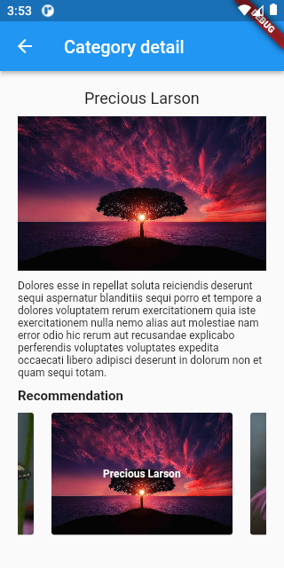

# Flutter bolderplate (riverpod + dio + getX)

Simple way to build your application
- state management (riverpod)
- model (freezed)
- dependency injection (getX)


|||
:---:|:---:

## Setup
```
fvm flutter pub get # install dependences
./sh/build_runner.sh # run build runner script
```

## Server
run server
```
cd server;
yarn start;
```


## structure

- ui/
  - category
  - common
- models/
  - category
- services/
  - category_service
- repositories/
  - dio # config dio
- utils/